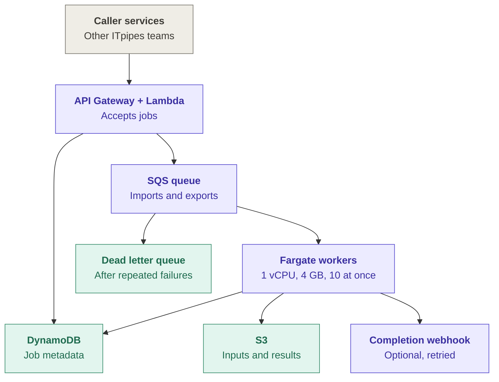
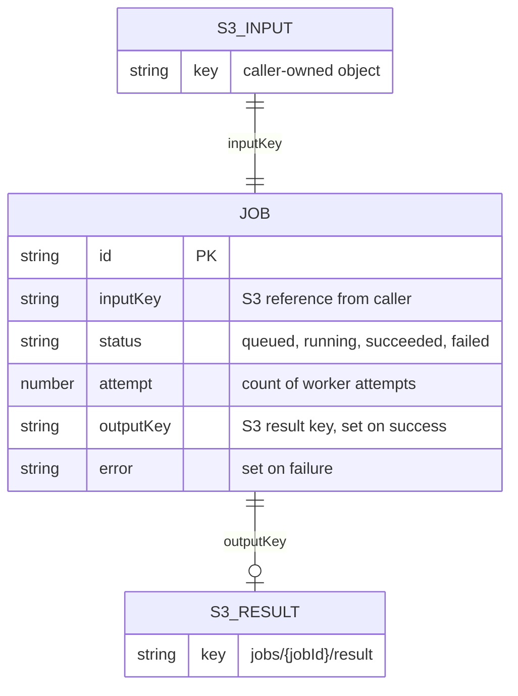
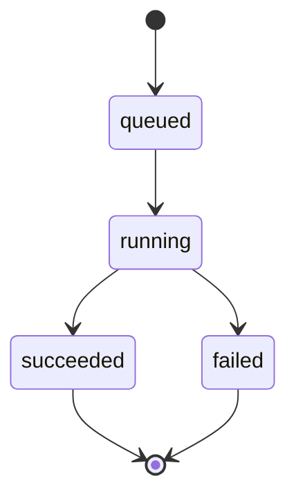

# Design Review — Legacy File Conversion Service

 
Assumptions and open questions are in NOTES.md.
 
---
 
## Risk ranking

### 1. As proposed, no export ever finishes. Two separate reasons.

The handler gives every job 30 seconds. Exports take tens of minutes, so every one of them times out. Fix that and they still die: the task is 1 vCPU / 4 GB running 10 conversions at 2 GB each. That is 20 GB asked of a 4 GB box, on one core. Fargate also hands out 20 GB of disk by default, and a package is 10 to 40 GB. This is the exit 137 the team keeps seeing, and why the same job passes later on a quieter worker.

**Impact:** the export half of the product does not work. Imports mostly squeak through, slowly.

### 2. Unfenced writes. The one failure nobody sees.

SQS delivers at least once, and two copies of a job have already shown up under 100 ms apart. The handler reads the job, converts, and writes back what it read. Two workers can both run it and both publish. A slow attempt can land on top of a faster one.

**Impact:** the job says succeeded and the customer gets the wrong package. Nothing alarms. Inspection data could be wrong for weeks before anyone notices.

### 3. One queue and one fleet for two very different jobs

Imports are seconds to minutes. Exports are tens of minutes. They share one queue, one visibility timeout, one task shape. Set the timeout for imports and every export gets redelivered mid-run. Set it for exports and a dead import worker sits on its message for half an hour. During an onboarding burst the fast imports queue up behind the slow exports.

**Impact:** duplicate work, and an import backlog that looks like an outage to the customer being onboarded.

### Leaving alone

**Webhooks.** Retries with backoff are fine. Callers can poll, so a lost webhook is a latency problem. Revisit if more than 1% of deliveries exhaust their retries in a week, or a consumer says they cannot poll.

**More job states.** Four is enough. Revisit if exports regularly pass an hour, or "is this stuck?" tickets come in more than about weekly. At that point callers need to tell running from retrying.

---

## Smallest changes before v1

Cannot ship without these:

1. **Per-type timeout, and kill what times out.** 15 minutes for imports, 90 for exports, picked from a `jobType` field on the job. A conversion that loses the race gets killed and reaped, or its 2 GB stays leased.
2. **Fix the task shape.** One conversion per 1 vCPU / 4 GB task. Export tasks get ephemeral storage above 40 GB, or stream to S3.
3. **Conditional writes on every state change.** Claim, publish, fail. If the row moved since you read it, you lose and ack.
4. **Exit 2 fails on the first try.** A broken file does not get better with retries. Everything else goes back to the queue and SQS counts the attempts, so real failures reach the DLQ instead of being acked away.
5. **Two queues, two fleets.** The visibility timeout has to differ and it is a per-queue setting. Everything else about the split can follow.

Can wait:

- **Visibility heartbeat.** Once the queues are split, set the export queue's visibility timeout to the export ceiling and skip the heartbeat in v1.
- **Persisting the idempotency key** with a lookup. Once writes are fenced, a duplicate submission costs money but cannot corrupt anything.
- **More job states.** See above.
- **S3 lifecycle rule on export packages.** Cheap and worth doing early, but it does not gate v1.

---
 
## Job lifecycle

 
**Ownership.** The API owns the transition to `queued`. The worker owns every transition after that. Nothing else writes job state.
 
### Import
 
1. Caller `POST`s an S3 reference and an idempotency key. API writes the job as `queued` and sends one message to the import queue. Returns the jobId.
2. A worker receives the message and conditionally moves `queued → running`, guarded on the job not already being terminal. If the guard fails, another worker owns it; ack and stop.
3. The converter writes JSON to `jobs/{jobId}/result.json`.
4. **The result is published to S3 before any status write.** The status write is what makes it visible.
5. Worker conditionally writes `succeeded` with the `outputKey`, guarded on the job still being `running` for this attempt. Then acks.
6. Caller learns the outcome by polling the job API, or from the optional webhook, fired after the status write and never able to change the job's outcome.
### Export
 
Identical, with three differences: the message goes to the export queue; the worker heartbeats the visibility timeout while the JVM runs; the package is written to S3 by multipart upload, and the pointer swap in step 5 is what makes it visible.
 
**Retry boundaries.** Transient failures (including exit 137) return the message to the queue and SQS increments `receiveCount`. Permanent failures (exit 2 — malformed input) mark the job `failed` immediately with the converter's message; retrying cannot help. Past `maxReceiveCount` the message moves to the DLQ and the job is marked `failed`. Attempts write to attempt-scoped keys and are promoted to the canonical result only on the guarded status write, so a late attempt cannot overwrite a published result.
 
---
 
## Operations, deployment, and observability
 
### Signals
 
| | Metric | Emitted by | Threshold | Action |
|---|---|---|---|---|
| **1** | `ApproximateAgeOfOldestMessage`, per queue | SQS, native CloudWatch metric | imports > 15 min; exports > 90 min | Alert. Check whether the fleet scaled; if it did, capacity or a stuck consumer is the problem, not backlog. This is the SLO-facing signal — queue depth alone cannot tell a burst from a stall. |
| **2** | `ApproximateNumberOfMessagesVisible` on each DLQ | SQS, native CloudWatch metric | > 0 sustained 5 min | Page. Every DLQ message is a job a customer will not get. Inspect, fix, then redrive with `StartMessageMoveTask`. |
| **3** | Job outcomes by `jobType` and failure class (exit 2 / exit 137 / timeout / other), plus p95 duration | Worker, as CloudWatch EMF on stdout at the terminal status write | failure rate > 5% over 15 min, or any exit-137 above baseline | Investigate. Exit 137 means task sizing or leaked subprocesses; a spike immediately after a deploy triggers rollback. |
 
Signal 3 is the only one that needs code. EMF is a JSON shape the worker logs; CloudWatch parses it into metrics from the log stream, so the same line is readable locally and becomes a metric in production.
 
### Getting a change to production
 
Infrastructure lives in the repo as CDK — queues, DLQs, task definitions, scaling policies, alarms — so the alarms above are versioned with the code that emits them. A push runs typecheck, unit tests, and image build in GitHub Actions; the image is pushed to ECR under an immutable commit-SHA tag and deployed to staging, where a smoke run pushes a small import and export end to end. Production is an ECS rolling update with the deployment circuit breaker enabled, so a task that fails to stabilise rolls back automatically; the three signals above plus CloudWatch alarm state cover the rest during a bake period. A bad release is reversed by redeploying the previous SHA — no rebuild, no mutable tag to race. Two things to know while deploying: autoscaling is suspended during a deployment, so a deploy during a burst delays scale-out, and in-flight messages may still be processed by the old task version, so every change must tolerate both versions running at once.
 
---
 
## Sizing and cost
 
### Onboarding evening — 3,000 jobs
 
Stated mix: 80/20 → **2,400 imports, 600 exports**. Using the upper end of the stated durations, 3 min per import and 30 min per export.
 
- Import work: 2,400 × 3 min = **120 conversion-hours**
- Export work: 600 × 30 min = **300 conversion-hours**
Concurrency per task is capped by `min(vCPU, memory ÷ 2 GB)`.
 
- **Import task:** 2 vCPU / 8 GB → 2 concurrent. Drain target 2 hours → 60 concurrent → **30 tasks**.
- **Export task:** 1 vCPU / 4 GB, ephemeral storage above the largest package → 1 concurrent. Drain target 6 hours (overnight) → 50 concurrent → **50 tasks**.
Scale-out is not instant: the fleet starts at zero, target-tracking takes a few minutes to react, and tasks must pull an image and start. The first jobs of the evening wait several minutes regardless of fleet size. Scale-in must be slow, and must not use CPU as its signal — a task running a 30-minute export looks idle.
 
### Normal volume — 1,000 jobs/day
 
- 800 imports × 3 min = 40 conversion-hours/day
- 200 exports × 30 min = 100 conversion-hours/day
- ≈ **140 conversion-hours/day ≈ 4,200/month**, with export tasks accounting for roughly 70% of it.
### Line items to price
 
- **Fargate** — vCPU-hours and GB-hours for the import fleet (2 vCPU / 8 GB tasks) and export fleet (1 vCPU / 4 GB tasks), ~4,200 task-hours/month plus burst headroom
- **Fargate ephemeral storage** — GB-month above the 20 GB included, on export tasks only
- **S3 storage** — result objects at 90-day retention: ~24,000 imports/month at up to 500 MB, ~6,000 exports/month at 10–40 GB
- **S3 requests** — PUT (including multipart parts) and GET per job
- **S3 data transfer out** — export packages downloaded by customers
- **DynamoDB** — on-demand reads and writes, ~10 operations per job, plus storage at 90-day retention
- **SQS** — requests across both queues and both DLQs, including empty long-poll receives
- **Lambda + API Gateway** — one invocation and one request per submission, plus polling
- **CloudWatch** — custom metrics from EMF, log ingestion and storage, alarms
- **ECR** — image storage
- **NAT Gateway** — hourly plus per-GB, if tasks run in private subnets without S3 and DynamoDB VPC endpoints
**Expected biggest line item: S3 storage.** Exports dominate — 6,000 packages a month at 10–40 GB held for 90 days is on the order of a petabyte-month of resident data, and nothing else in this system is in that range.
 
**Single change that would cut it the most:** shorten export package retention, or move packages to a cheaper class after the first few days. Metadata retention is 90 days because customers need job history; the 40 GB artifact itself is typically downloaded once, within hours. A lifecycle rule to Infrequent Access or Glacier Instant Retrieval after ~7 days, with a shorter expiry on the package than on the metadata, addresses the largest cost without touching the customer-facing contract. **This needs confirmation** — see NOTES.md — that no customer relies on re-downloading a package weeks later.
 
---
 
## What addresses each production observation
 
| Observation | Addressed by |
|---|---|
| Two deliveries for the same job reach different workers <100 ms apart | Conditional write on the `queued → running` transition — the second worker's guard fails and it acks without converting. Attempt-scoped output keys mean neither can corrupt the other's artifact. |
| An invalid database exits quickly with code 2 | Failure classification: exit 2 is permanent, marked `failed` on the first attempt with the converter's message surfaced to the caller. No retries, no DLQ. |
| A converter sometimes exits 137 and succeeds on a later run | Root cause is memory exhaustion. Fixed by capping concurrency at `min(vCPU, memory ÷ 2 GB)` and by reaping abandoned subprocesses. Residual 137s are classified transient and retried, and alarm via signal 3. |
| A timed-out subprocess continues running unless terminated and reaped | Timeout path kills the conversion and waits for the process to exit before releasing the message. Per-type timeouts mean the export path stops firing spuriously in the first place. |
| A slow attempt finishes after another attempt published a result | Publication is a guarded transition, not a blind write. The late attempt's guard fails, it discards its artifact, and the published result stands. |