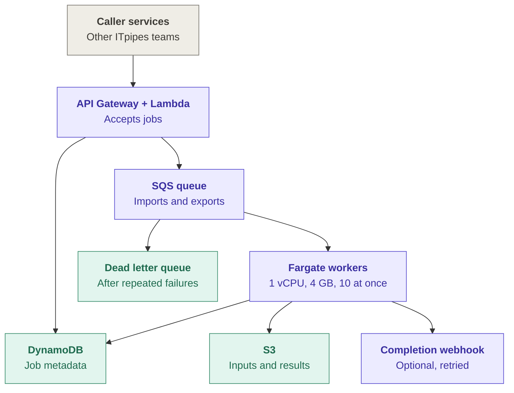
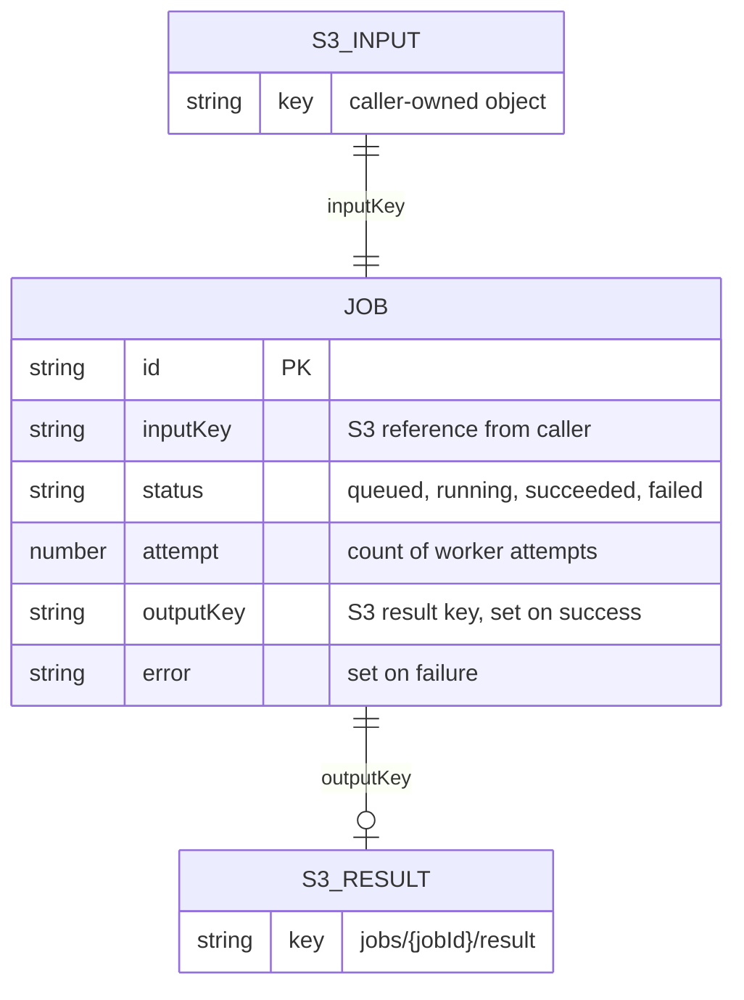
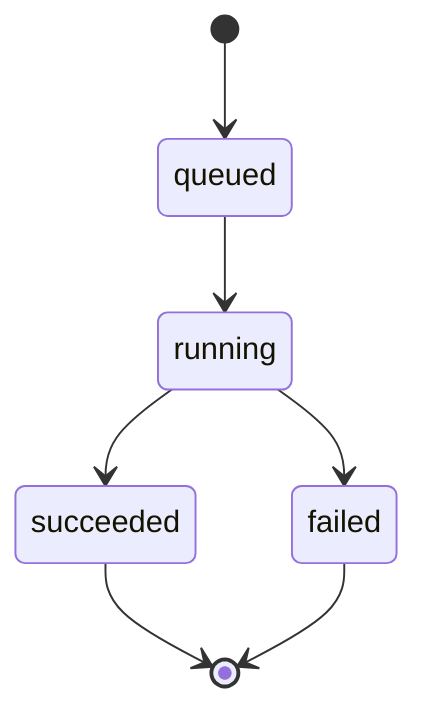

# Design Review — Legacy File Conversion Service

 
Assumptions and open questions are in NOTES.md.
 
---
 
## Risk ranking

### 1. As proposed, no export ever finishes. Two separate reasons.

The handler gives every job 30 seconds. Exports take tens of minutes, so every one of them times out. Fix that and they still die: the task is 1 vCPU / 4 GB running 10 conversions at 2 GB each. That is 20 GB asked of a 4 GB box, on one core. Fargate also hands out 20 GB of disk by default, and a package is 10 to 40 GB. This is the exit 137 the team keeps seeing, and why the same job passes later on a quieter worker.

**Impact:** the export half of the product does not work. Imports mostly squeak through, slowly.

### 2. Unfenced writes. The one failure nobody sees.

SQS delivers at least once, and two copies of a job have already shown up under 100 ms apart. The handler reads the job, converts, and writes back what it read. Two workers can both run it and both publish. A slow attempt can land on top of a faster one.

**Impact:** the job says succeeded and the customer gets the wrong package. Nothing alarms. Inspection data could be wrong for weeks before anyone notices.

### 3. One queue and one fleet for two very different jobs

Imports are seconds to minutes. Exports are tens of minutes. They share one queue, one visibility timeout, one task shape. Set the timeout for imports and every export gets redelivered mid-run. Set it for exports and a dead import worker sits on its message for half an hour. During an onboarding burst the fast imports queue up behind the slow exports.

**Impact:** duplicate work, and an import backlog that looks like an outage to the customer being onboarded.

### Leaving alone

**Webhooks.** Retries with backoff are fine. Callers can poll, so a lost webhook is a latency problem. Revisit if more than 1% of deliveries exhaust their retries in a week, or a consumer says they cannot poll.

**More job states.** Four is enough. Revisit if exports regularly pass an hour, or "is this stuck?" tickets come in more than about weekly. At that point callers need to tell running from retrying.

---

## Smallest changes before v1

Cannot ship without these:

1. **Per-type timeout, and kill what times out.** 15 minutes for imports, 90 for exports, picked from a `jobType` field on the job. A conversion that loses the race gets killed and reaped, or its 2 GB stays leased.
2. **Fix the task shape.** One conversion per 1 vCPU / 4 GB task. Export tasks get ephemeral storage above 40 GB, or stream to S3.
3. **Conditional writes on every state change.** Claim, publish, fail. If the row moved since you read it, you lose and ack.
4. **Exit 2 fails on the first try.** A broken file does not get better with retries. Everything else goes back to the queue and SQS counts the attempts, so real failures reach the DLQ instead of being acked away.
5. **Two queues, two fleets.** The visibility timeout has to differ and it is a per-queue setting. Everything else about the split can follow.

Can wait:

- **Visibility heartbeat.** Once the queues are split, set the export queue's visibility timeout to the export ceiling and skip the heartbeat in v1.
- **Persisting the idempotency key** with a lookup. Once writes are fenced, a duplicate submission costs money but cannot corrupt anything.
- **More job states.** See above.
- **S3 lifecycle rule on export packages.** Cheap and worth doing early, but it does not gate v1.

---
 
## Job lifecycle

 
This is the flow after the v1 changes above. Where today's proposal does something different, I say so.

**Who owns what.** DynamoDB holds job state. The API writes `queued`; the worker writes everything after that. SQS owns delivery and retries. S3 owns the bytes. Nothing else touches job state.

### Import

1. Caller `POST`s an S3 key and an idempotency key. The API writes the job as `queued`, puts one message on the import queue, and returns the jobId.
2. A worker picks up the message and moves the job `queued → running` with a conditional write. If the row changed since it was read, another worker got there first. Ack and stop. (Today this is a plain put, and both workers run the job.)
3. The converter writes JSON to `jobs/{jobId}/attempts/{n}/result.json`. Every attempt gets its own key. (Today every attempt writes to the same key.)
4. Bytes land in S3 before any status changes. The status write is what makes the result visible.
5. The worker conditionally writes `succeeded` with the `outputKey`, guarded on the job still being `running` for this attempt. If a faster attempt already published, the write is refused and this output is left unreferenced. Then ack.
6. The caller polls the job API or gets the optional webhook. The webhook fires after the status write and cannot change the outcome.

### Export

Same flow, three differences. The message goes to the export queue. That queue's visibility timeout is set to the export ceiling, 90 minutes, so a running JVM is never redelivered mid-run and v1 needs no heartbeat. (Today one queue shares one timeout with imports.) The package goes to S3 as a multipart upload, and the pointer swap in step 5 is what publishes it.

**Retry boundaries.**

- **Transient** (exit 137, timeout): if it timed out, kill and reap the converter first. Then hand the message back and let SQS bump `receiveCount`. The job stays `running`.
- **Permanent** (exit 2, broken file): mark the job `failed` with the converter's message and ack. No retries. The customer needs to hear the file is broken, not wait through three attempts. (Today exit 2 is retried like everything else.)
- **Past `maxReceiveCount`:** SQS moves the message to the DLQ. (Today the handler counts to three itself and deletes the message, so the DLQ never sees anything.) The job still reads `running` while it sits there. An operator inspects, fixes the cause, and redrives, or fails the job by hand. The clean fix is a `retrying` state, which is a caller-visible change, so it is on the later list, not v1.

---
 
## Operations, deployment, and observability
 
### Signals
 
| | Metric | Emitted by | Threshold | Action |
|---|---|---|---|---|
| **1** | `ApproximateAgeOfOldestMessage`, per queue | SQS, native CloudWatch metric | imports > 15 min; exports > 90 min | Alert. Check whether the fleet scaled; if it did, capacity or a stuck consumer is the problem, not backlog. This is the SLO-facing signal — queue depth alone cannot tell a burst from a stall. |
| **2** | `ApproximateNumberOfMessagesVisible` on each DLQ | SQS, native CloudWatch metric | > 0 sustained 5 min | Page. Every DLQ message is a job a customer will not get. Inspect, fix, then redrive with `StartMessageMoveTask`. |
| **3** | Job outcomes by `jobType` and failure class (exit 2 / exit 137 / timeout / other), plus p95 duration | Worker, as CloudWatch EMF on stdout at the terminal status write | failure rate > 5% over 15 min, or any exit-137 above baseline | Investigate. Exit 137 means task sizing or leaked subprocesses; a spike immediately after a deploy triggers rollback. |
 
Signal 3 is the only one that needs code. EMF is a JSON shape the worker logs; CloudWatch parses it into metrics from the log stream, so the same line is readable locally and becomes a metric in production.
 
### Getting a change to production
 
Infrastructure lives in the repo as CDK — queues, DLQs, task definitions, scaling policies, alarms — so the alarms above are versioned with the code that emits them. A push runs typecheck, unit tests, and image build in GitHub Actions; the image is pushed to ECR under an immutable commit-SHA tag and deployed to staging, where a smoke run pushes a small import and export end to end. Production is an ECS rolling update with the deployment circuit breaker enabled, so a task that fails to stabilise rolls back automatically; the three signals above plus CloudWatch alarm state cover the rest during a bake period. A bad release is reversed by redeploying the previous SHA — no rebuild, no mutable tag to race. Two things to know while deploying: autoscaling is suspended during a deployment, so a deploy during a burst delays scale-out, and in-flight messages may still be processed by the old task version, so every change must tolerate both versions running at once.
 
---
 
## Sizing and cost

**Assumptions.** The brief gives ranges, so I picked numbers and wrote them down:

- 3 minutes per import and 30 per export, the top of the stated ranges.
- One conversion per 1 vCPU / 4 GB task. Export tasks get 60 GB of ephemeral storage.
- An export package averages 25 GB, an import result 0.5 GB. Results stay in S3 for 90 days, same as the metadata. Input files live in the caller's bucket, not on this bill.
- Packages get downloaded once, by customer software outside AWS. This is the assumption that swings the bill the most, see below.
- us-east-1 list prices, rounded. The point is the shape of the bill, not the cents. The pricing calculator is the source of truth.

### The onboarding evening: 3,000 jobs

80/20 mix, so 2,400 imports and 600 exports.

| Fleet | Work | Drain target | Tasks needed |
|---|---|---|---|
| Import | 2,400 × 3 min = 120 task-hours | 2 hours | 60 |
| Export | 600 × 30 min = 300 task-hours | 6 hours, overnight | 50 |

Peak is 110 tasks, 110 vCPU. Compute for the whole evening is about $25, so money is not the problem. Two other things are. Scaling from zero takes a few minutes for the alarm to fire and tasks to pull the image, so the first jobs wait no matter how big the fleet is. And 110 concurrent Fargate vCPU is above the default quota on a fresh account, so the quota needs raising before the first onboarding, not during it. Scale-in has to be slow and must not key off CPU, because a task in the middle of a 30 minute export looks idle.

### Normal volume: 1,000 jobs a day

**Compute.** 800 × 3 min = 40 task-hours, plus 200 × 30 min = 100 task-hours, so 140 task-hours a day. A 1 vCPU / 4 GB task is about $0.058 an hour. That is $8 a day, roughly $250 a month, call it $400 with idle polling and retries.

**Storage.** 200 packages × 25 GB = 5 TB a day. Kept 90 days, that is 450 TB sitting in S3 at any time. Imports add about 36 TB. Around 486 TB at roughly $0.022 per GB-month is about $10,700 a month.

**Egress.** 5 TB a day out to customers is 150 TB a month. Tiered internet egress on that is about $11,300. If the consuming software runs in the same region, this line is close to zero.

| Line item | Monthly, rough |
|---|---|
| S3 storage, ~486 TB resident | ~$10,700 |
| Data transfer out, 150 TB, only if packages leave AWS | ~$11,300 |
| Fargate, both fleets | ~$400 |
| DynamoDB, SQS, Lambda, API Gateway, CloudWatch, ECR | under $50 combined |
| **Total** | **~$11k a month in-region, ~$22k if packages leave AWS** |

One trap worth naming. If the workers sit in private subnets and reach S3 through a NAT gateway, that is roughly 12 TB a day of inputs and outputs through NAT at $0.045 per GB, about $16,000 a month, more than everything else combined. Gateway endpoints for S3 and DynamoDB are free and make it zero. That goes in the CDK on day one.

**Biggest line item: S3 storage.** Exports are 5 TB a day and nothing else in the system is in that range.

**The single change that cuts it the most:** a lifecycle rule that moves packages to Glacier Instant Retrieval after 7 days. Seven days in Standard plus 83 days at $0.004 per GB comes to about $2,500 a month instead of $10,700. That is roughly 75% off, and a late re-download still works, it just costs 3 cents a GB. This needs one check with the customer teams: does anyone re-download a package weeks later? If not, expiring packages at 30 days cuts it further still.

---
 
## What addresses each production observation
 
| Observation | Addressed by |
|---|---|
| Two deliveries for the same job reach different workers <100 ms apart | Conditional write on the `queued → running` transition — the second worker's guard fails and it acks without converting. Attempt-scoped output keys mean neither can corrupt the other's artifact. |
| An invalid database exits quickly with code 2 | Failure classification: exit 2 is permanent, marked `failed` on the first attempt with the converter's message surfaced to the caller. No retries, no DLQ. |
| A converter sometimes exits 137 and succeeds on a later run | Root cause is memory exhaustion. Fixed by capping concurrency at `min(vCPU, memory ÷ 2 GB)` and by reaping abandoned subprocesses. Residual 137s are classified transient and retried, and alarm via signal 3. |
| A timed-out subprocess continues running unless terminated and reaped | Timeout path kills the conversion and waits for the process to exit before releasing the message. Per-type timeouts mean the export path stops firing spuriously in the first place. |
| A slow attempt finishes after another attempt published a result | Publication is a guarded transition, not a blind write. The late attempt's guard fails, it discards its artifact, and the published result stands. |